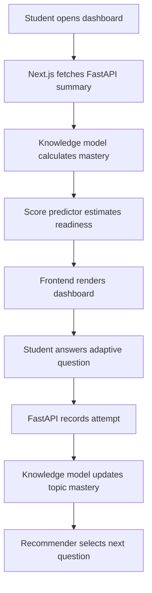

# Learning Optimization Engine Architecture

## Layers

1. **Frontend - Next.js**
   - Dashboard and heatmaps
   - Adaptive quiz feed
   - AI tutor chat UI
   - Study timeline graph
   - Auth pages

2. **API Gateway - FastAPI**
   - REST endpoints for dashboard, quiz attempts, recommendations, tutor, and predictions
   - Future JWT auth, rate limiting, and Redis pub/sub

3. **AI Engine**
   - Knowledge Model: Bayesian topic mastery updates
   - Recommendation Engine: next best topic and activity selection
   - Spaced Repetition: due revision queue
   - Tutor: local explanation fallback, OpenAI-ready integration point
   - Risk Model: topic risk classification
   - Score Predictor: projected exam score from mastery and attempts

4. **Database Layer**
   - MVP uses seeded in-memory repositories
   - Production target: PostgreSQL, Redis, pgvector

5. **External Services**
   - OpenAI API for tutoring
   - pgvector or Pinecone for retrieval
   - Vercel for frontend deployment
   - Railway/Render/Fly.io for backend deployment

## MVP Data Flow

## Production Upgrade Path

- Persist repositories with SQLAlchemy models and Alembic migrations.
- Store authentication users separately from learning profiles.
- Publish attempt-created events to Redis.
- Recompute recommendations asynchronously for large cohorts.
- Add embeddings for concept notes, solved examples, and question explanations.
